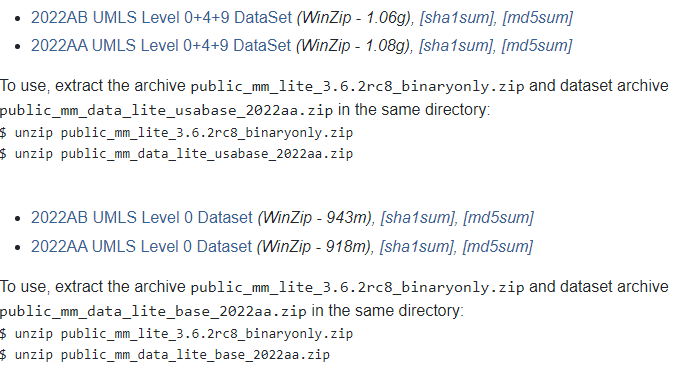
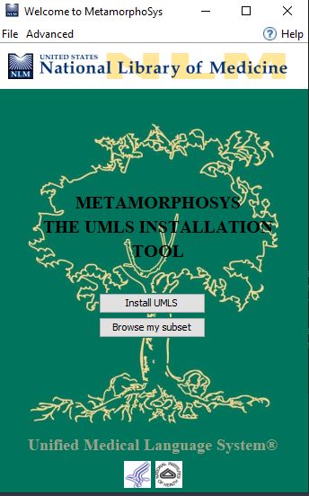
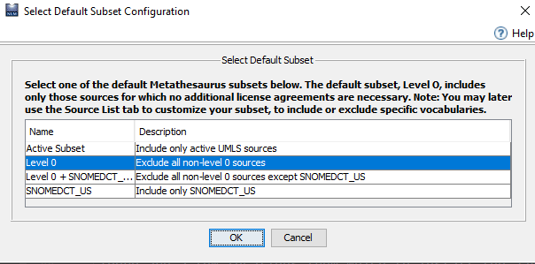
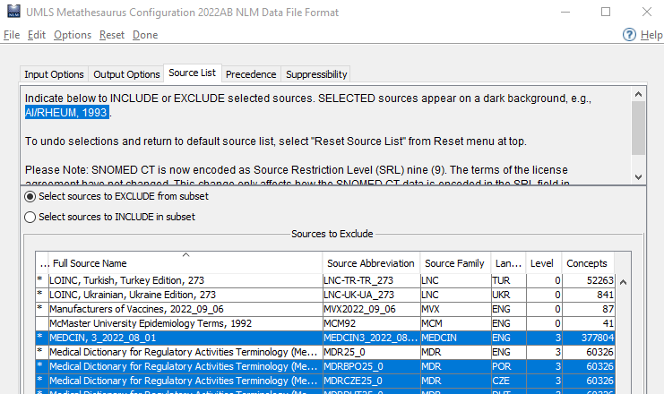

# Build UMLS for Metamaplite

Using specific UMLS subsets for running Metamaplite.

## Pre-built Subsets

On the Metamaplite [home page](https://lhncbc.nlm.nih.gov/ii/tools/MetaMap/run-locally/MetaMapLite.html#Downloads) there are pre-built subsets of the UMLS which include either just the Level 0 vocabulary or the Level 0+4+9 vocabularies. To include these in your installation:



1. Download the desired dataset from the [Downloads section](https://lhncbc.nlm.nih.gov/ii/tools/MetaMap/run-locally/MetaMapLite.html#Downloads) of the Metamaplite home page.
2. Extract/unzip the archive into the same directory as Metamaplite.
   * In other words, the `DataSet` archives contain content that should be placed in `$METAMAPLITE_BASE/data/ivf`
   * The content does not *need* to be placed in this directory if you prefer a different organizational structure (see step #3)
3. If running using the shell script (`metamaplite.sh` or `metamaplite.bat`), update that script to point to the appropriate subset.
   * Namely, the option `-Dmetamaplite.index.directory` should point to the unpacked directory.

## Building Custom Subset

The pre-built subsets are the easiest way to go, but that doesn't work for all applications. Let's suppose, e.g., your project requires MedDRA which is a level 4 vocabulary and not currently included in any pre-built subset. How can we include it? We will follow the following three steps:

1. Download the full UMLS (with `mmsys`/Metamorphosys)
2. Download the [LVG](https://lhncbc.nlm.nih.gov/LSG/Projects/lvg/current/web/index.html)
3. Run `mmsys` to get the desired subset.
4. Index the subset
5. Run MML pointing to this subset

### Step 1: Download the full UMLS

NB: At some point, you will be prompted to login. If you don't yet have a UMLS account, register here: [](umls_license.md#create-umls-account)

1. Navigate to the [UMLS Knowledge Sources Downloads](https://www.nlm.nih.gov/research/umls/licensedcontent/umlsknowledgesources.html).
2. Choose a download under `Full UMLS Release Files`. It should be around 35GB and include a description stating that it 'includes...MetamorphoSys'.
3. Unzip the archive.
4. Inside the archive, you'll also find a `mmsys.zip` which also needs to be extracted.
   * This contains MetamorphoSys (mmsys) which we'll be using to build a subset.

### Step 2: Download the LVG.

The LVG is a lexical variant generator which will generate lexical variants for all the terms in your preferred subset. This allows a greater capture of terms that the base words alone.

1. Download LVG from the [NIH website](https://lhncbc.nlm.nih.gov/LSG/Projects/lvg/current/web/download.html).
   * If this link doesn't work, search for `lexical tools nih`
   * Unless you have another reason, download the 'Full Version'
2. Extract the `tgz` archive (on Windows, you may need to use something like 7-zip).
   * I placed it in `D:\lvg2023`
   * This will be the `LVG_DIR` referred to later when indexing the UMLS subset.
3. There are shell scripts, but I don't usually use these...just run the following command from the `LVG_DIR` (e.g., in `lvg202X` where directories include 'bin', 'lib', 'install', 'examples', etc.):
   * Windows: `java -cp ".;lib\lvg2023api.jar;install\lib\lvgInstall.jar;lib\jdbcDrivers\HSqlDb\hsqldb.jar" gov.nih.nlm.nls.lvg.install.Setup.LvgInstall`
   * Linux (untested): `java -cp ".:lib/lvg2023api.jar:install/lib/lvgInstall.jar:lib/jdbcDrivers/HSqlDb/hsqldb.jar" gov.nih.nlm.nls.lvg.install.Setup.LvgInstall`

### Step 3: Run MetamorphoSys

1. In the directory where you unzipped `mmsys.zip`, locate the `run` shell script for your system:
   * Linux: `run_linux.sh`
   * Mac: `run_mac.sh`
   * Windows: `run64.bat`
```{admonition} Windows Users
Ensure that you are running `run64.bat` and not `run.bat` which points to the 32-bit version.

Alternatively, you can update the `run.bat` line 11 from `jre\windows` to `jre\windows64` (this is the only difference).
```
2. Run the target shell script and MetamorphoSys will open.

3. To create a new subset, choose `Install UMLS`.
4. Ensure that `Source` points to your installation and update `Destination` to point to your desired output.
5. Click `OK`
6. If this is your first time, choose `New Configuration...`.
   * If you want to use an existing configuration file that you have, select `Open Configuration...`
7. `Accept` the license agreement notice.
8. The `Select default subset` allow you to select the starting configuration which can be helpful for some use cases.
   * E.g., if you want only Level 0 sources, SNOMED_CT, and MedDRA, start with `Level 0 + SNOMEDCT_US`, and then add MDR after clicking OK.

   * If you don't need anything pre-selected (e.g., you just want MedDRA), pick anything and just select to include only MDR after clicking OK.
9. Find the `Source List` tab. Here, pay attention to the top where the selected sources (i.e., the ones highlighted blue) are either INCLUDED or EXCLUDED.
   * Sort alphabetically or by level by clicking on any headers
   * Be careful not to click the sources, otherwise you will lose your selection
     * If this happens, find the `Reset` menu item at the top and reset the source lists.
   * To find `MedDRA`, I sort by `Full Source Name` and find the `m`s.
     * Hold the `Ctrl` key and add to the selection by clicking the target vocabulary

10. When you are done adding sources (and any other configurable options), save the configuration file with `File` > `Save Configuration`
11. Then, build the subset with `Done` > `Begin Subset`.
12. This may take a while depending on the number of vocabularies...So go pour yourself some more tea and have a croissant.

### Step 4: Index the Subset

You have now created a UMLS subset to run, but it is not yet indexed for Metamaplite. To index it, follow the steps below. Instructions are also available on [MML README](https://github.com/lhncbc/metamaplite#generating-indexes-from-umls-tables).

1. Locate your MML installation directory (`$MML_HOME`).
2. Under `$MML_HOME/bin`, there should be two `create_indexes` scripts, one for each system.
3. Open this file as it will likely require some updates/modifications.
   * Update the MML version to ensure it matches yours. E.g., I updated mine from `3.6.2rc5` to `3.6.2rc8`
     * This is just needed for the name of the jar file in `$MML_HOME/target` so you can look up your version there.
   * Add the `LVG_DIR` to point to where you downloaded the LVG in step 2
     * `set LVG_DIR=D:\lvg2023` or `LVG_DIR=~/lvg2023` 
   * On Windows, in the call to 'GenerateVariants' (between lines 50-60), add `"-Dgv.words.temp.filename=words.txt.tmp"` between `-Xmx4g` and `-cp`.
     * This fixes an issue where the default file is set to a unix value.
     * See issue status: https://github.com/lhncbc/metamaplite/issues/22
   * On Windows (and maybe Linux), create the directory `%IVFDIR%\indices\meshtcrelaxed`
     * See issue status: https://github.com/lhncbc/metamaplite/issues/21
4. You can either run this from the command line with four arguments or update the four lines beginning with `MRCONSO` (`set MRCONSO` on Windows) to the correct paths.
   * One option is to create a copy of this `create_indexes.bat` script called, e.g., `create_indexes_mdr.bat` and modify the arguments. This will help provide documentation/reproducibility.
5. When running, if you get an error:
   * `java.io.FileNotFoundException: \tmp\words.txt.tmp`: see Step 4, #3, bullet 3
   * `java.io.FileNotFoundException: tables/vars.txt`: see Step 4, #3, bullet 3
   * `java.io.FileNotFoundException: indices/meshtcrelaxed/postings`: see Step 4, #3, bullet 4
   * `java.lang.OutOfMemoryError: GC overhead limit exceeded`: identify the failed call and increase the memory limit (e.g., increase `-Xmx7g` to `-Xms12g`)

```{admonition} Hidden Errors in the Output
When the `create_indexes` script completes, take a couple minutes to ensure that there are no errors. There is a lot of output generated which might obscure an error in an intermediate step. Consider piping the data to a text file to more easily explore.
```

### Step 5: Run Metamaplite

1. In the `IVFDIR` (i.e., the output directory from step 4), you'll find two directories, 'indices' and 'tables'.
2. Use the `IVFDIR` as the `metamaplite.index.directory` option when running Metamaplite.
3. Using `mml_utils`, the command line should look something like this:
   * `mml-run-filelist --properties metamaplite.index.directory C:\umls\2022AB\meddra\ivf --filelist filelist.txt --mml-home $MML_HOME`
