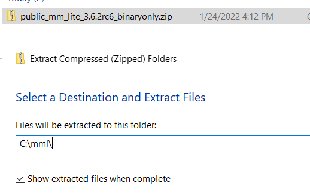
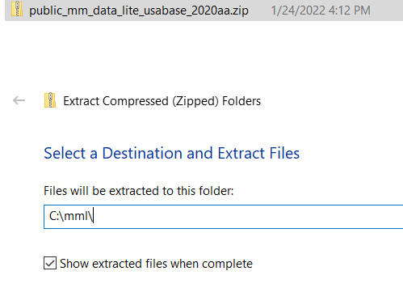

# Installing MetaMapLite

These instructions are for installing Metamaplite on Windows. Most of these steps would likely be pretty similar on
other systems...

## Prerequisites

There is a complete and updated list of prerequisites on
the [MetaMapLite homepage](https://lhncbc.nlm.nih.gov/ii/tools/MetaMap/run-locally/MetaMapLite.html#Prerequisites), but
the main components are:

* UMLS Terminology Services (UTS) Acccount
* Java 8 (JRE is fine)
    * From Oracle: https://www.java.com/en/download/
    * Amazon Corretto: https://docs.aws.amazon.com/corretto/latest/corretto-8-ug/downloads-list.html

### UMLS License

*If you already have a UMLS Terminology Services account, skip this step.*

```{admonition} UTS Account Required
An account is required in order to use the UMLS Metathesaurus (the vocabulary backend to Metamaplite which MetaMapLite uses to map text to NLP concepts).
```

1. To create an account, visit: https://uts.nlm.nih.gov/uts/signup-login.
2. By doing this, you will agree to the UMLS License: https://uts.nlm.nih.gov/uts/assets/LicenseAgreement.pdf
3. To keep your account current (i.e., to keep being able to use it), you will need to annually complete a survey
   describing which sources, etc., you used, along with any suggestions for improvements.

### Install Java

The current requirements for running MetaMapLite are Java 8 JRE (JDK is okay as well).

There are a few locations from which to install the Java runtime:

* From Oracle: https://www.java.com/en/download/
* From Amazon (Ccorretto): https://docs.aws.amazon.com/corretto/latest/corretto-8-ug/downloads-list.html
* Or other implementations of OpenJDK: https://en.wikipedia.org/wiki/OpenJDK#OpenJDK_builds

Once Java is installed, test the installation:

1. Open a *new* `powershell` or other command prompt.
2. Type `java -version`.
    1. If you get some information about the version, you're good to go.
    2. If you get some variant of 'not recognized' or 'command not found', you'll need to add Java to your path.

To add java to your path:

1. `Windows Button` + type 'environment'
2. `Edit the system environment variables`
3. `Environment Variables`
4. Add `New` with name `JAVA_HOME` and path to base of install
   
5. Edit the `PATH` variable by adding the entire path with `\bin` to the `PATH` variable
   
6. Exit out of all command prompts (e.g., `powershell`), and open a new one. Type `java`.

## Download and Install

1. Visit the [Metamaplite Website](https://lhncbc.nlm.nih.gov/ii/tools/MetaMap/run-locally/MetaMapLite.html#Downloads).
   If this links is
   broken, [file an issue](https://github.com/kpwhri/batch_metamaplite/issues/new?title=Broken+Link+for+Metamaplite) and
   search for ['metamaplite'](https://www.google.com/search?q=metamaplite).
2. Go to 'Downloads' and find the box with the most recent version of MetaMapLite.


### Download MetaMapLite

1. Download the most recent version of MetaMapLite (`3.6.2rc6` in the above image).
    * If you have previously installed MetaMapLite, you do not *need* to update, but it's usually a good idea.
    * You may require a particular version if, e.g., replicating previous work.
2. Login with your UTS Account if you are not already logged in.
3. `Right click` the downloaded zip archive, and choose `Extract All` to `C:\mml` (or similar)
   
4. MetaMapLite has now been installed to `C:\mml\public_mm_lite`. This is the application's `HOME_DIRECTORY` and will be
   used in most of the `mml_utils` scripts.

You have now installed MetaMapLite, though it doesn't have any data, so it's probably not particularly useful yet...let'
s install the UMLS backend.

### Download UMLS Dataset

1. Download the most recent version of the UMLS Level 0+4+9 dataset (`2020AB UMLS Level 0+4+9 Dataset` in the image
   above).
2. Login with your UTS Account if you are not already logged in.
3. `Right click` the downloaded zip archive, and choose `Extract All` to `C:\mml` (or *the same path* you selected
   when [unzipping MetaMapLite](#download-metamaplite))

```{admonition} Multiple UMLS Datasets
You can download multiple datasets to the same MetaMapLite installation, though each will require a different name/location. Selecting these can be done by editing the `metamaplite.bat` launch file or the `config\metamaplite.properties` file's `metamaplite.index.directory`.
```



No indexing is required for this download, but you should first test the installation.

#### Downloading Other UMLS Vocabularies

If you need other UMLS vocabularies (e.g., MedDRA), you will need to download, install, and index the
larger [UMLS dataset](https://www.nlm.nih.gov/research/umls/index.html). A step-by-step guide for this is
available [here](install_umls.md).

## Test the Installation

1. Open a new `powershell` windows (or other command prompt).
2. Go to the HOME_DIRECTORY (`cd C:\mml\public_mm_lite`).
3. Run `echo "asymptomatic patient populations" | .\metamaplite.bat --pipe`
4. You should see output like:

```
00000000.tx|MMI|0.92|Patients|C0030705|[podg]|"Patient"-text-0-"patient"-NN-0|text|13/7|M01.643|
00000000.tx|MMI|0.46|Asymptomatic|C0231221|[fndg]|"Asymptomatic"-text-0-"asymptomatic"-JJ-0|text|0/12||
00000000.tx|MMI|0.46|Disabled Person Code - Patient|C1578486|[inpr]|"Patient"-text-0-"patient"-NN-0|text|13/7||
00000000.tx|MMI|0.46|Mail Claim Party - Patient|C1578481|[idcn]|"Patient"-text-0-"patient"-NN-0|text|13/7||
00000000.tx|MMI|0.46|Relationship modifier - Patient|C1578484|[idcn]|"Patient"-text-0-"patient"-NN-0|text|13/7||
00000000.tx|MMI|0.46|Report source - Patient|C1578483|[idcn]|"Patient"-text-0-"patient"-NN-0|text|13/7||
00000000.tx|MMI|0.46|Specimen Source Codes - Patient|C1578485|[inpr]|"Patient"-text-0-"patient"-NN-0|text|13/7||
00000000.tx|MMI|0.46|Specimen Type - Patient|C1550655|[bdsu]|"Patient"-text-0-"patient"-NN-0|text|13/7||
00000000.tx|MMI|0.46|Veterinary Patient|C1705908|[orgm]|"Patient"-text-0-"patient"-NN-0|text|13/7||
00000000.tx|MMI|0.46|geographic population|C0032659|[qnco]|"Populations"-text-0-"populations"-NNS-0|text|21/11||
```

5. Or, if you prefer `json` format (this project
   does): `echo "asymptomatic patient populations" | .\metamaplite.bat --pipe --outputformat=json`
   * NB: The output below is formatted and abridged.

```json
[  
  {
    "matchedtext": "asymptomatic",
    "evlist": [
      {
        "score": 0,
        "matchedtext": "asymptomatic",
        "start": 0,
        "length": 12,
        "id": "ev0",
        "conceptinfo": {
          "conceptstring": "Asymptomatic",
          "sources": [
            "LNC",
            "CHV",
            "SNMI",
            "NCI_CDISC",
            "NCI",
            "SNOMEDCT_US",
            "NCI_NCI-GLOSS"
          ],
          "cui": "C0231221",
          "preferredname": "Asymptomatic",
          "semantictypes": [
            "fndg"
          ]
        }
      }
    ],
    "docid": "00000000.tx",
    "start": 0,
    "length": 12,
    "id": "en0",
    "fieldid": "text"
  }
]
```

For additional details about using MetaMapLite to process text files, see: [](using_mml.md)

## Troubleshooting

### Java Not Recognized/Found

1. Ensure that Java 8 is installed (see [Install Java](#install-java)).
2. Close all instances of `powershell` or other command prompt. Open a new one and type `java`.
